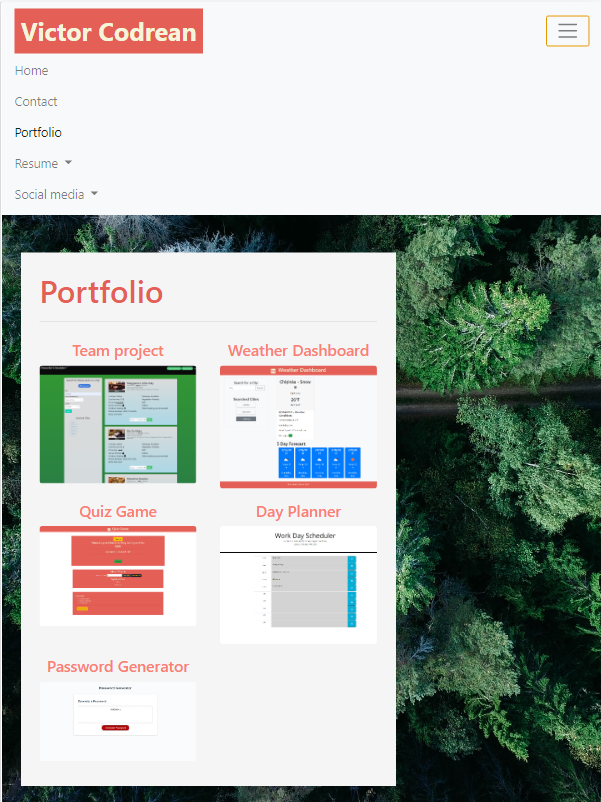

# Portfolio-UpToDate - [Deployed product](https://victorcodrean.github.io/Portfolio-UpToDate/)

# Table of Contents

- [Description](#Description)
- [About page](#About)
- [Contact page](#Contact)
- [Portfolio page](#Portfolio)
- [Style CSS](#StyleCSS)
- [Credits](#Credits)
- [Contributing](#Contributing)
- [Directory](#Directory)
- [Screeenshots](#Pictures)

## Description
   Updated Portfolio page that includes projects I worked on
## About
* Consistent Navbar from Boostrap for each page.
    *  On each page contain links to Home/About, Contact, Resume, Social Medias and Portfolio page.
* Main element in a container:
    * 1 row and a column that occupies 8 spaces out of 12. (rule of 12 Bootstrap Gryd System)
* Consistent Footer from Bootstrap for each page.

## Contact
* Consistent Navbar from Boostrap for each page.
    *  On each page contain links to Home/About, Contact, and Portfolio page.
* Main element in a container:
    * 1 row and 2 columns...
    * 2-nd column nested inside 1-st column (because 2-nd column leaves 2gryd lines free    of space)
* Consistent Footer from Bootstrap for each page.

## Portfolio
* Projects included

## StyleCSS
Background img, style properties, footer style and  **media query** for header responsivness.

## Credits
* List of the resources used to complete this project:
- [Bootstrap](https://getbootstrap.com/) - Very Usefull with 12 Gryd System
- [W3Schools](https://www.w3schools.com/) - PDF anchoring

## Contributing
* Name: Victor Codrean
* [Email](CodreanVictor@gmail.com)
* [GitHub](https://github.com/VictorCodrean)

## Directory
* [Deployed Website](https://victorcodrean.github.io/Portfolio-UpToDate/)
* [GitHub Source](https://github.com/VictorCodrean/Portfolio-UpToDate)

## Pictures with shared projects:

